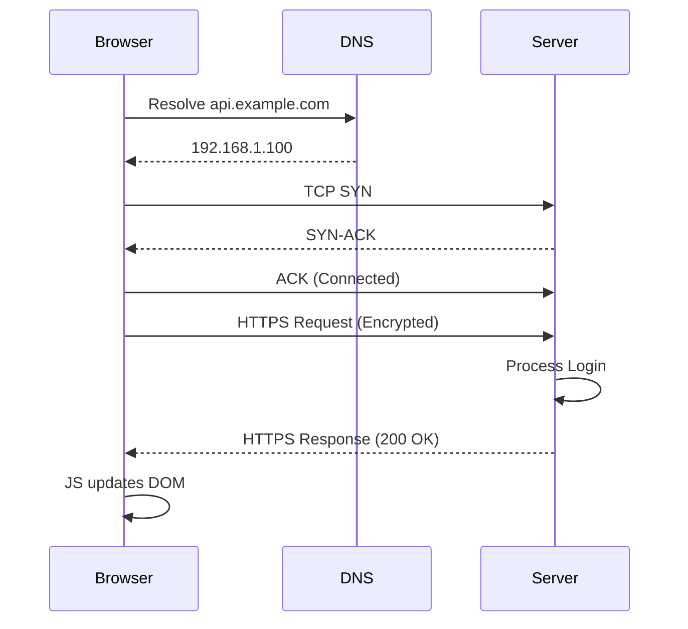

# Khi Networking Gặp Gỡ JavaScript

Sau khi hoàn thành 3 khóa học Cisco, đây là bức tranh toàn cảnh về cách một ứng dụng web vận hành.

## Kịch Bản: Người Dùng Bấm Nút "Đăng Nhập"

### 1. JavaScript (Frontend)

```javascript
const loginButton = document.getElementById('login-btn');

loginButton.addEventListener('click', async () => {
    const username = document.getElementById('username').value;
    const password = document.getElementById('password').value;
    
    try {
        const response = await fetch('/api/login', {
            method: 'POST',
            headers: { 'Content-Type': 'application/json' },
            body: JSON.stringify({ username, password })
        });
        
        const data = await response.json();
        console.log("Đăng nhập thành công!");
    } catch (error) {
        console.error("Lỗi:", error);
    }
});
```

**Những gì xảy ra:**
* Event Listener bắt sự kiện click
* Lấy dữ liệu từ form
* Gọi `fetch()` - Bất đồng bộ (Async)

### 2. Networking Layers Vào Cuộc

#### A. DNS Resolution
* **Vấn đề:** Trình duyệt cần biết IP của `api.example.com`
* **Giải pháp:** Gửi DNS Query (sử dụng UDP port 53)
* **Kết quả:** Nhận IP address (VD: `192.168.1.100`)

#### B. TCP Three-Way Handshake
Trước khi gửi dữ liệu, phải thiết lập kết nối TCP:

1. **SYN:** Client → Server ("Tôi muốn kết nối")
2. **SYN-ACK:** Server → Client ("OK, tôi sẵn sàng")
3. **ACK:** Client → Server ("Xác nhận!")

#### C. HTTP Request
Sau khi TCP kết nối, gửi HTTP Request:

```http
POST /api/login HTTP/1.1
Host: api.example.com
Content-Type: application/json
Content-Length: 45

{"username":"tai","password":"secret"}
```

#### D. TLS/SSL (Nếu HTTPS)
* **Presentation Layer:** Mã hóa dữ liệu
* **Handshake:** Trao đổi certificate
* **Encryption:** Dữ liệu được bảo vệ khỏi Man-in-the-Middle

#### E. Data Encapsulation (OSI Model)

```
[Application] HTTP Request
[Presentation] + SSL/TLS Encryption
[Transport] + TCP Header (Port, Sequence Number)
[Network] + IP Header (Source/Dest IP)
[Data Link] + Ethernet Frame
[Physical] → Bits qua dây cáp/wifi
```

### 3. Server Xử Lý và Phản Hồi

Server nhận request, xử lý logic (kiểm tra username/password), rồi gửi response:

```http
HTTP/1.1 200 OK
Content-Type: application/json

{"status":"success","token":"abc123"}
```

### 4. JavaScript Nhận Response

```javascript
const data = await response.json();
// Promise fulfilled
if (data.status === 'success') {
    localStorage.setItem('token', data.token);
    window.location.href = '/dashboard';
}
```

## Toàn Bộ Quy Trình (End-to-End)



## Những Điều Học Được

### Từ Networking Basics:
* **OSI/TCP-IP Models:** Hiểu cách dữ liệu di chuyển qua các tầng
* **IP Addressing:** Routing từ client đến server
* **TCP vs UDP:** Web dùng TCP vì cần tin cậy
* **DNS:** Chuyển domain thành IP

### Từ JavaScript Essentials:
* **Event Handling:** Bắt user interaction
* **Async/Await:** Xử lý API call không block UI
* **Fetch API:** Giao tiếp với backend
* **JSON:** Format dữ liệu chuẩn

## Kết Luận

Lập trình viên giỏi không chỉ biết viết code (JavaScript) mà còn phải hiểu con đường code đó di chuyển (Networking). 

**Kiến thức từ Cisco NetAcad đã cho tôi nền tảng vững chắc để:**
* Debug network issues (timeout, DNS errors)
* Optimize performance (HTTP/2, CDN)
* Understand security (HTTPS, SSL certificates)
* Build better web applications

Code và Network không tách rời - chúng là hai mặt của cùng một hệ thống!
